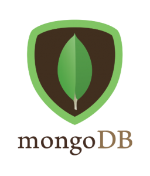

<p align="center">

  </p>

> 스타벅스 모의어플 백엔드

mongoDB,nodejs를 이용해 구성했습니다
<br>

## 목차

- [목차](#목차)
- [기술스택](#기술스택)
- [설계](#설계)
- [파이프 라인](#파이프-라인)
  - [스타벅스 메뉴조회 API](#스타벅스-메뉴조회-api)
  - [토큰 인증 API](#토큰-인증-api)
  - [휴대폰 인증 완료 API](#휴대폰-인증-완료-api)
  - [회원 가입 API](#회원-가입-api)
  - [회원 목록 조회 API](#회원-목록-조회-api)
- [프로젝트 설치 및 실행 방법](#프로젝트-설치-및-실행-방법)
- [폴더 구조](#폴더-구조)

## 기술스택

   <p align="center">
📑&nbsp&nbsp&nbsp사용언어
  </p>
<p align="center">

  </p>
 <p align="center">
🏠&nbsp&nbsp&nbsp데이터베이스
  </p>
 <p align="center">

&nbsp&nbsp
</p>
 <p align="center">
🚀 서버 구성
 <p align="center">

<p align="center">


&nbsp&nbsp


</p>
<p align="center">
🎨 데이터 크롤러
<p align="center">

</p>

## 설계

-   Server FrameWork : Node.js
-   API Docs : Swagger Docs
-   DB : MongoDB (NoSQL)
-   ODM : Mongoose
-   crawler : puppeteer

## 파이프 라인

### 스타벅스 메뉴조회 API


### 토큰 인증 API


### 휴대폰 인증 완료 API


### 회원 가입 API


### 회원 목록 조회 API


## 프로젝트 설치 및 실행 방법

-   git clone https://github.com/leokim1178/mini-project-1
-   terminal commands

```
# local :  docker (권장)
docker 설치
docker compose build
docker compose up

# Deployed Server URL
URL : https://main-project.leo3179.shop/graphql
```

-   frontend 폴더
    -   login, menou, user 내의 index.html을 실행하여 api 테스트

## 폴더 구조

```
mini-project
├─ 🚀 backend
│  ├─ 🐳 .dockerignore
│  ├─ 🐳 Dockerfile
│  ├─ 🐳 docker-compose.yaml
│  ├─ 📮 email.js
│  ├─ index.js
│  ├─ models
│  │  ├─ ☕️ starbucks.model.js
│  │  ├─ 🪙 token.model.js
│  │  └─ 👩🏻‍💻 user.model.js
│  ├─ 🎒 package.json
│  ├─ 📞 phone.js
│  ├─ 🎨 scrapper.js
│  ├─ swagger
│  │  ├─ config.js
│  │  ├─ phone-swagger.js
│  │  ├─ starbucks-swagger.js
│  │  ├─ user-swagger.js
│  │  └─ users-swagger.js
│  └─ utils.js
├─ ➬ frontend
├─ imgs
├─ .gitignore
├─ .prettierrc
├─ README.md
└─ webcrawler
   ├─ index.js
   ├─ models
   │  └─ starbucks.model.js
   └─ package.json
```
